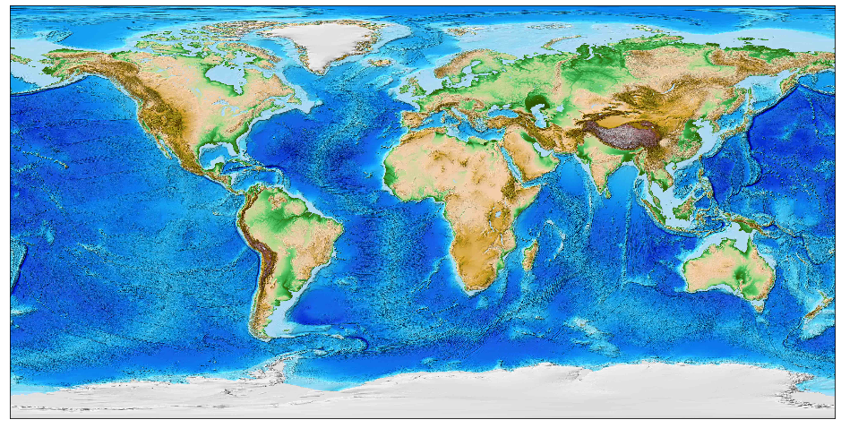

# GeoData



Created SQLite Databases Only With The Most Main Nodes From OpenStreetMap Data.
The Main Nodes Are Nodes Wich Represent An Single Point With An Tag From The Following Types:

- aeroway *(Flughafen)*
- amenity *(Einrichtung)*
- craft *(Handwerk)*
- emergency *(Notfall)*
- leisure *(Freizeit)*
- man_made *(Von Menschen Erschaffene Bauliche Strukturen)*
- military *(Milit&auml;r)*
- place *(Ortsangaben)*
- power *(Energieversorgung)*
- shop *(Gesch&auml;fte)*
- vending *(Automaten)*

---

## Databases

I Tried To Keep The Databases Very Easy:

- [X] No High Sophisticated Column Types
- [X] No Foreign Keys
- [X] No Indexes (Everyone Has Different Needs Anyway)
- [X] No Triggers
- [X] No Extensions Is Needed Or Used (For Example SpatiaLite)

Only Two Tables Are Created And Used. 

This Make The Database Very Easy To Use And Is An Advantage For Some Tools.

---

## Tables

### `META`

The Meta Table Stores Only The BoundingBox Of The Original `.osm` File:

*SQL:*

```sql
CREATE TABLE META (

    MINLAT DOUBLE NOT NULL, -- The Minimum Latitude
    MAXLAT DOUBLE NOT NULL, -- The Maximum Latitude

    MINLON DOUBLE NOT NULL, -- The Minimum Longitude
    MAXLON DOUBLE NOT NULL  -- The Maximum Longitude
);
```

*Example:*

|MINLAT|MAXLAT|MINLON|MAXLON|
|:----:|:----:|:----:|:----:|
|47,26543|55,14777|5,864417|15,05078|


### `NODE`

The Node Table Stores Only The Most Important Data From The Main Nodes:

*SQL:*

```sql
CREATE TABLE NODE (

    ID INTEGER NOT NULL PRIMARY KEY, -- An Simple Primarkey (The Node Id From OSM)

    LAT DOUBLE NOT NULL,             -- The Latitude
    LON DOUBLE NOT NULL,             -- The Longitude

    NAME TEXT,                       -- The Name Of The Node (It's Mostly The Name In National Language)
    NAME_EN TEXT,                    -- The English Name Of The Node (When He Is Avaible)
    NAME_DE TEXT,                    -- The German Name Of The Node (When He Is Avaible)

    TAG TEXT NOT NULL,               -- The Tag Of The Node
    VALUE TEXT NOT NULL,             -- The Value From The Tag Of The Node

    POPULATION INTEGER,              -- The Population Of An City, Town Or Village
    ELEVATION INTEGER                -- The Elevation Of The Node (Meters Above Sea Level)
);
```

*Example:*


---

## Useful Links

- [OpenStreetMap Data Extracts](http://download.geofabrik.de)
- [OpenStreetMap Map Features](https://wiki.openstreetmap.org/wiki/DE:Map_Features)
