# World

---

## Africa [&#10159;](africa.sqlite)

### Allgemeine Informationen

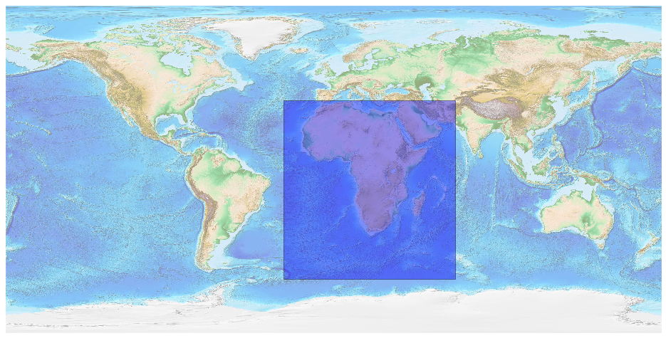

|Eigenschaft|Wert|
|-|-:|
Dateiname|[africa.sqlite](africa.sqlite)|
Zeitstempel|05.09.2019 10:58|
Dateigr&ouml;&szlig;e|103.84 Mb|
|||
Gesamtanzahl Nodes|2286129|
|MinLat|-60.3167|
|MaxLat|37.77817|
|MinLon|-27.262032|
|MaxLon|66.7227659|

### Top 5 Tags

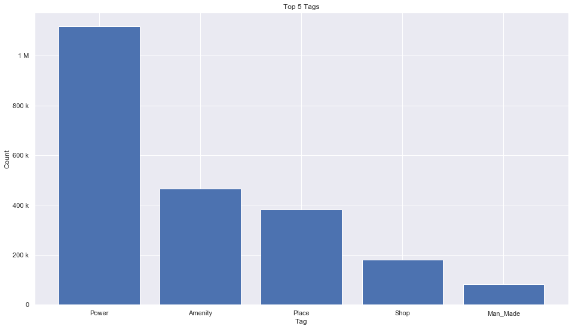

|Tag|Count|
|-|-:|
|Power|1117187|
|Amenity|466480|
|Place|381775|
|Shop|180800|
|Man_Made|82470|

### &Uuml;bersicht Ortsangaben

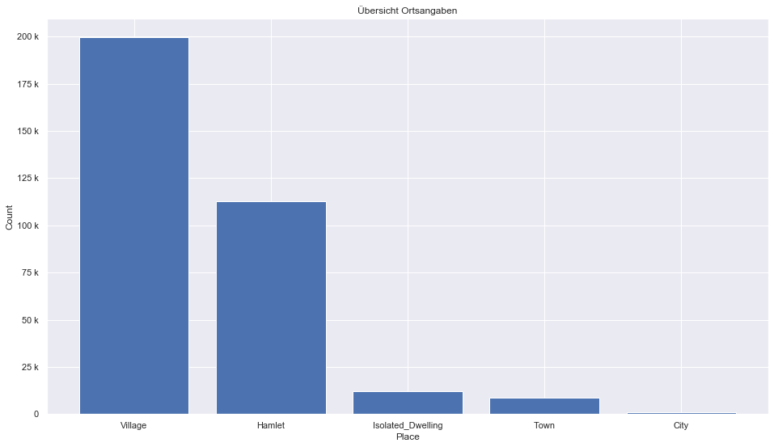

|Place|Count|
|-|-:|
|Village|199563|
|Hamlet|112762|
|Isolated_Dwelling|12259|
|Town|8734|
|City|953|

### Die 5 gr&ouml;&szlig;ten bewohnte Gebiete

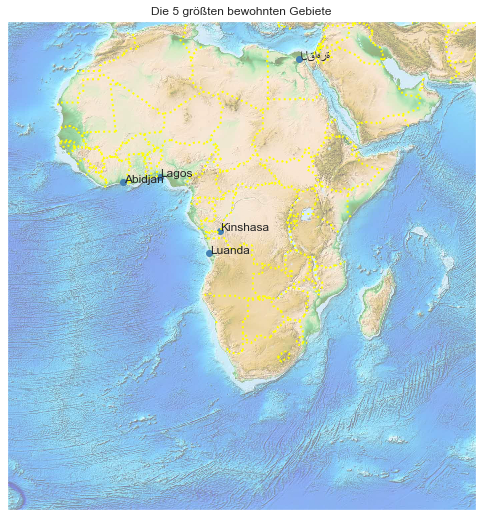

|Name|Lat|Lon|Type|Population|
|----|--:|--:|:--:|---------:|
|Lagos|6.4550575|3.3941795|City|10404112|
|القاهرة|30.048819|31.243666|City|9120350|
|Kinshasa|-4.3217055|15.3125974|City|9046000|
|Abidjan|5.320357|-4.016107|City|7567409|
|Luanda|-8.8272699|13.2439512|City|5172900|

---

## Antarctica [&#10159;](antarctica.sqlite)

### Allgemeine Informationen

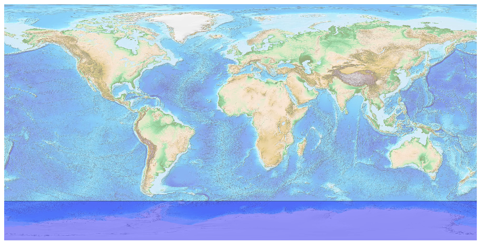

|Eigenschaft|Wert|
|-|-:|
Dateiname|[antarctica.sqlite](antarctica.sqlite)|
Zeitstempel|04.09.2019 20:52|
Dateigr&ouml;&szlig;e|36.00 Kb|
|||
Gesamtanzahl Nodes|426|
|MinLat|-90.0|
|MaxLat|-60.0|
|MinLon|-180.0|
|MaxLon|180.0|

### Top 5 Tags

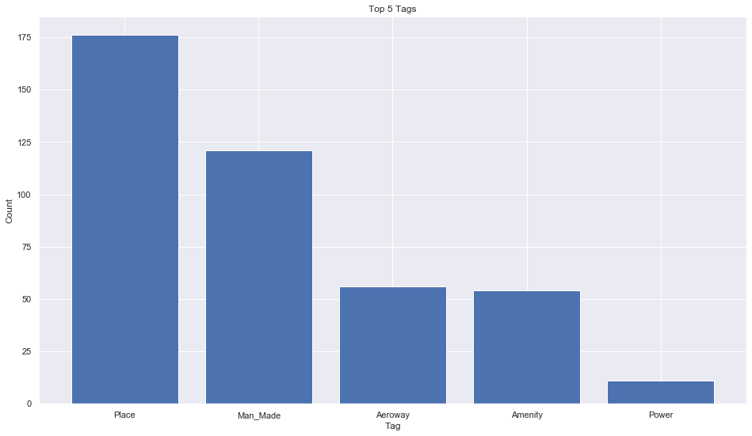

|Tag|Count|
|-|-:|
|Place|176|
|Man_Made|121|
|Aeroway|56|
|Amenity|54|
|Power|11|

### &Uuml;bersicht Ortsangaben

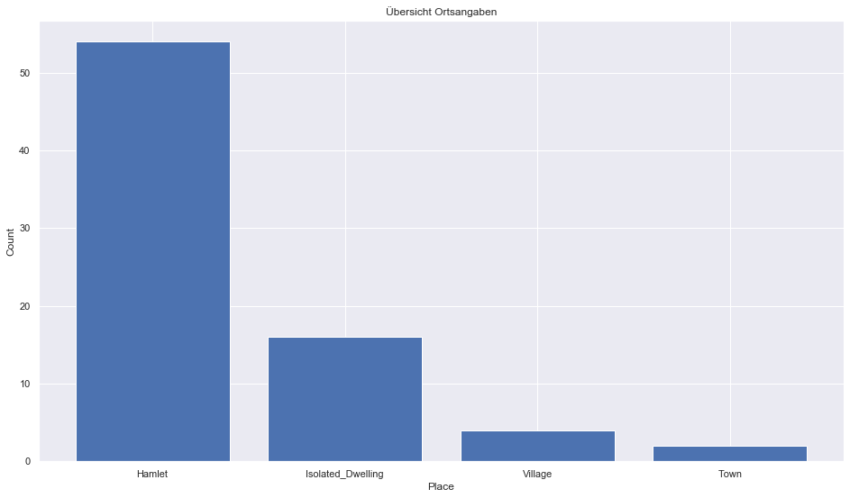

|Place|Count|
|-|-:|
|Hamlet|54|
|Isolated_Dwelling|16|
|Village|4|
|Town|2|

### Die 5 gr&ouml;&szlig;ten bewohnte Gebiete

|Name|Lat|Lon|Type|Population|
|----|--:|--:|:--:|---------:|
|McMurdo Station|-77.8444733|166.6696371|Town|1300|
|Arctowski|-62.1590141|-58.4719356|Hamlet|40|

---

## Asia [&#10159;](asia.sqlite)

### Allgemeine Informationen

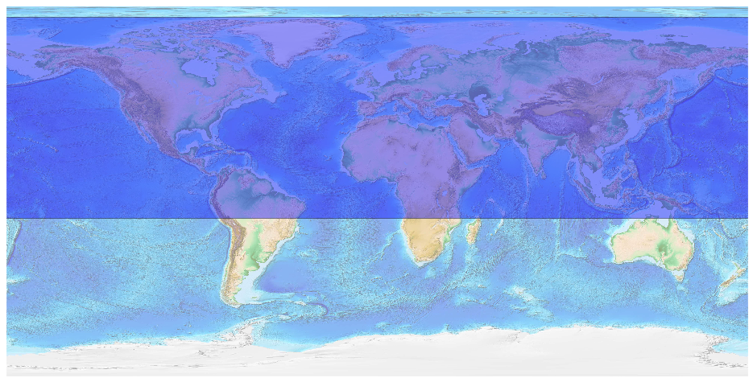

|Eigenschaft|Wert|
|-|-:|
Dateiname|[asia.sqlite](asia.sqlite)|
Zeitstempel|05.09.2019 13:21|
Dateigr&ouml;&szlig;e|413.61 Mb|
|||
Gesamtanzahl Nodes|9041041|
|MinLat|-13.01165|
|MaxLat|84.52666|
|MinLon|-180.0|
|MaxLon|180.0|

### Top 5 Tags

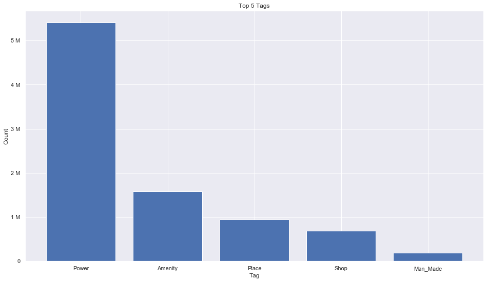

|Tag|Count|
|-|-:|
|Power|5403592|
|Amenity|1582211|
|Place|939887|
|Shop|689607|
|Man_Made|189791|

### &Uuml;bersicht Ortsangaben

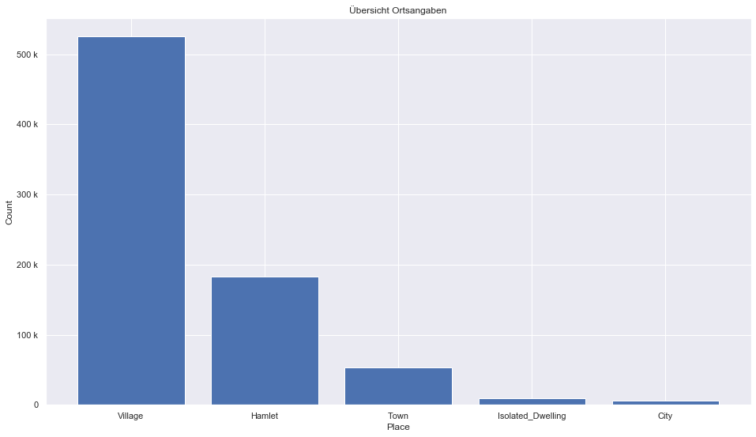

|Place|Count|
|-|-:|
|Village|525171|
|Hamlet|183159|
|Town|53276|
|Isolated_Dwelling|8918|
|City|5598|

### Die 5 gr&ouml;&szlig;ten bewohnte Gebiete

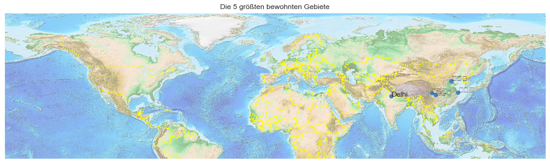

|Name|Lat|Lon|Type|Population|
|----|--:|--:|:--:|---------:|
|上海市|31.2252985|121.4890497|City|23019196|
|重庆市|29.5585712|106.5492822|City|18400000|
|成都市|30.6624205|104.0633219|City|17700000|
|Delhi|28.6517178|77.2219388|City|16787941|
|天津市|39.1235635|117.1980785|City|15500000|

---

## Australia Oceania [&#10159;](australia-oceania.sqlite)

### Allgemeine Informationen

|Eigenschaft|Wert|
|-|-:|
Dateiname|[australia-oceania.sqlite](australia-oceania.sqlite)|
Zeitstempel|05.09.2019 11:13|
Dateigr&ouml;&szlig;e|30.37 Mb|
|||
Gesamtanzahl Nodes|685378|
|MinLat|-57.16482|
|MaxLat|26.46478|
|MinLon|-180.0|
|MaxLon|180.0|

### Top 5 Tags

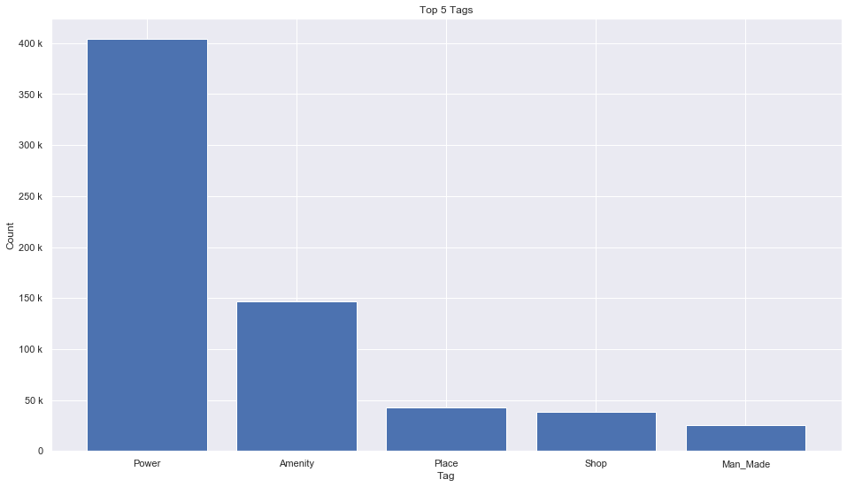

|Tag|Count|
|-|-:|
|Power|403859|
|Amenity|146361|
|Place|42932|
|Shop|38261|
|Man_Made|25788|

### &Uuml;bersicht Ortsangaben

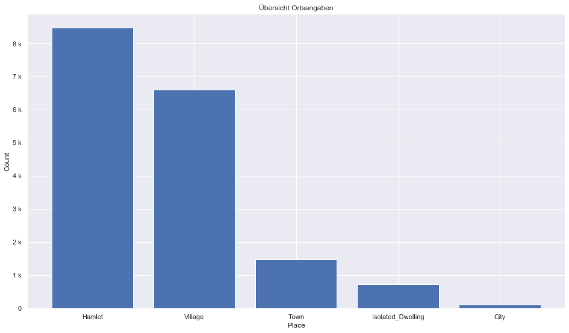

|Place|Count|
|-|-:|
|Hamlet|8475|
|Village|6616|
|Town|1472|
|Isolated_Dwelling|724|
|City|117|

### Die 5 gr&ouml;&szlig;ten bewohnte Gebiete

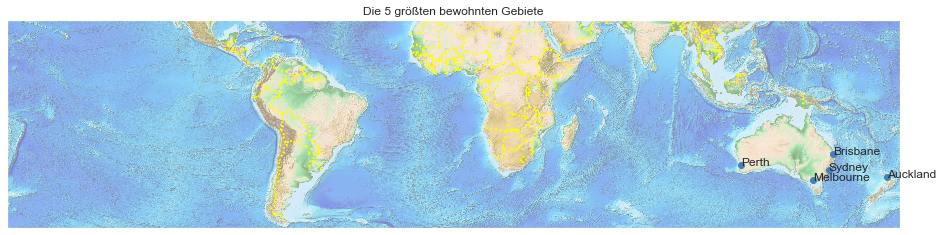

|Name|Lat|Lon|Type|Population|
|----|--:|--:|:--:|---------:|
|Sydney|-33.8548157|151.2164539|City|4627345|
|Melbourne|-37.8142176|144.9631608|City|4440300|
|Brisbane|-27.4689682|153.0234991|City|2190000|
|Perth|-31.9527121|115.8604796|City|1907833|
|Auckland|-36.852095|174.7631803|City|1413700|

---

## Central America [&#10159;](central-america.sqlite)

### Allgemeine Informationen

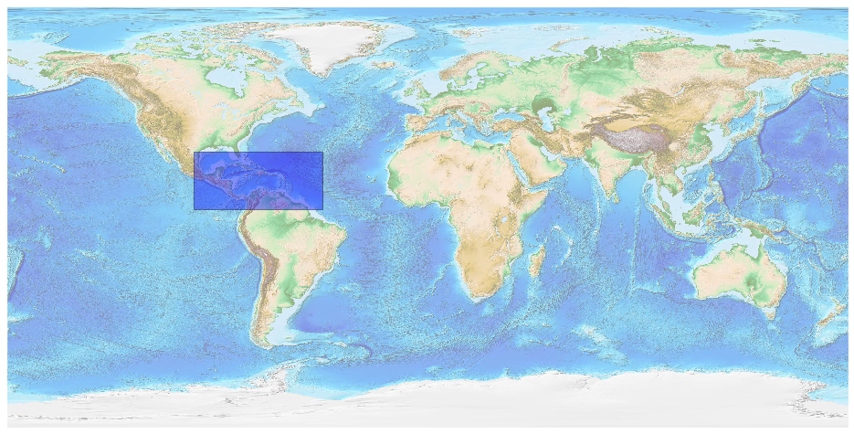

|Eigenschaft|Wert|
|-|-:|
Dateiname|[central-america.sqlite](central-america.sqlite)|
Zeitstempel|04.09.2019 20:59|
Dateigr&ouml;&szlig;e|13.73 Mb|
|||
Gesamtanzahl Nodes|267830|
|MinLat|3.283755|
|MaxLat|28.05483|
|MinLon|-99.82733|
|MaxLon|-44.93667|

### Top 5 Tags

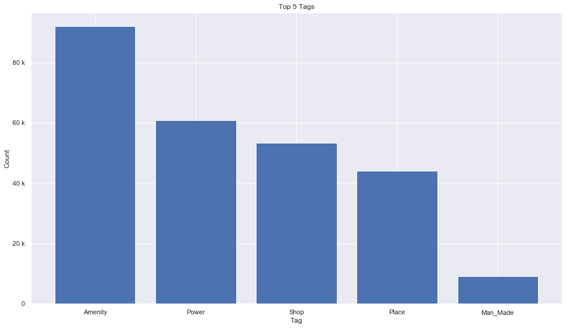

|Tag|Count|
|-|-:|
|Amenity|91886|
|Power|60864|
|Shop|53387|
|Place|44042|
|Man_Made|9138|

### &Uuml;bersicht Ortsangaben

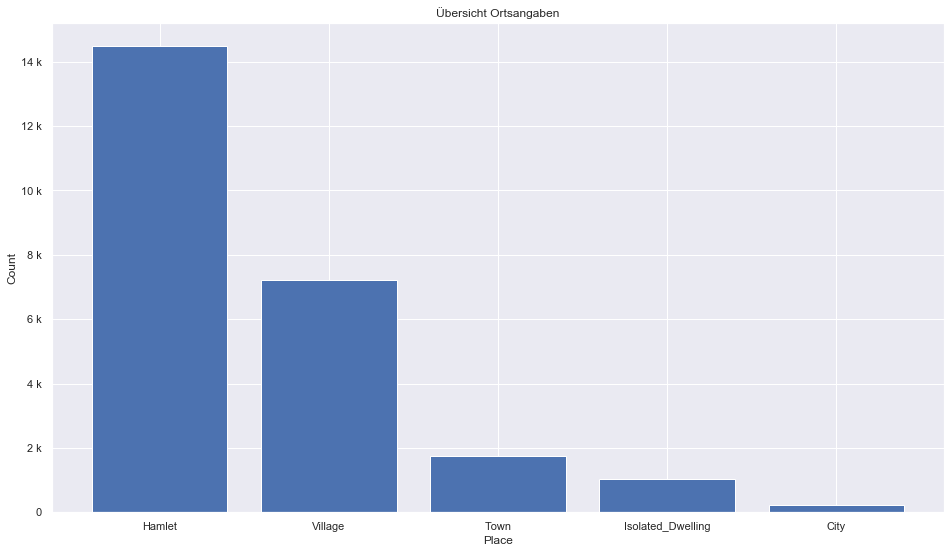

|Place|Count|
|-|-:|
|Hamlet|14479|
|Village|7217|
|Town|1755|
|Isolated_Dwelling|1018|
|City|235|

### Die 5 gr&ouml;&szlig;ten bewohnte Gebiete

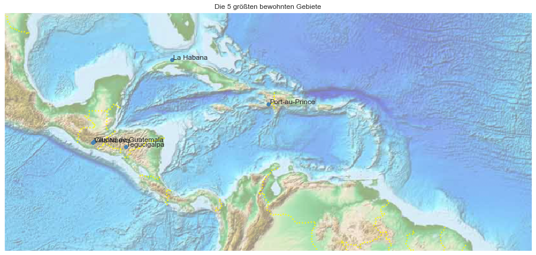

|Name|Lat|Lon|Type|Population|
|----|--:|--:|:--:|---------:|
|Ciudad de Guatemala|14.6222328|-90.5185188|City|2450212|
|La Habana|23.135305|-82.3589631|City|2141993|
|Villa Nueva|14.5252531|-90.5882601|City|1500000|
|Port-au-Prince|18.547327|-72.3395928|City|1275000|
|Tegucigalpa|14.0931919|-87.2012631|City|1120000|

---

## Europe [&#10159;](europe.sqlite)

### Allgemeine Informationen

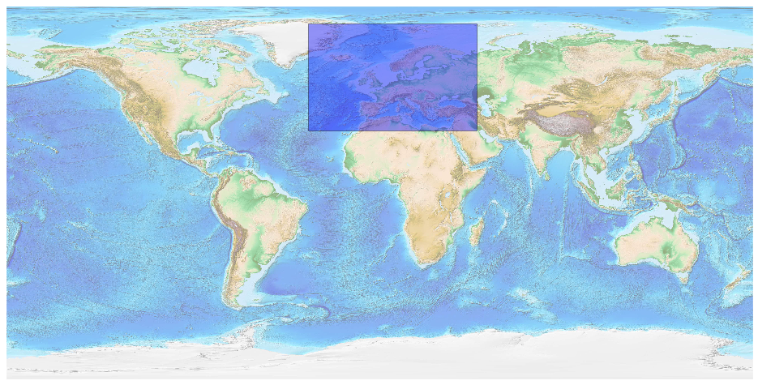

|Eigenschaft|Wert|
|-|-:|
Dateiname|[europe.sqlite](europe.sqlite)|
Zeitstempel|05.09.2019 18:59|
Dateigr&ouml;&szlig;e|875.00 Mb|
|||
Gesamtanzahl Nodes|18641815|
|MinLat|29.735139|
|MaxLat|81.47299|
|MinLon|-34.49296|
|MaxLon|46.75348|

### Top 5 Tags

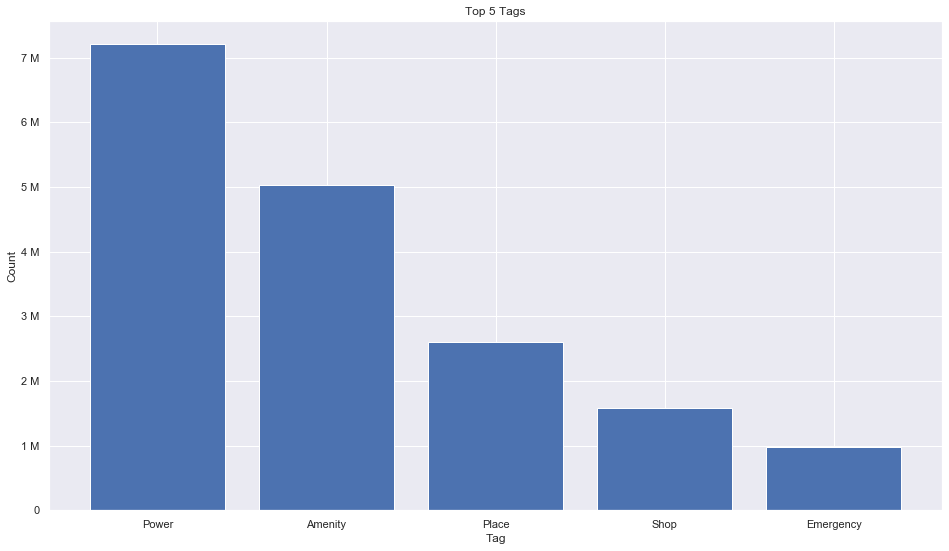

|Tag|Count|
|-|-:|
|Power|7204493|
|Amenity|5024277|
|Place|2606209|
|Shop|1579846|
|Emergency|975788|

### &Uuml;bersicht Ortsangaben

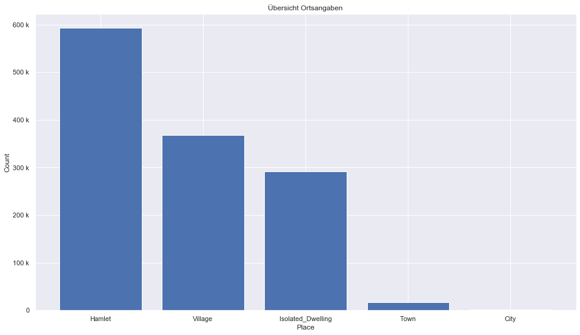

|Place|Count|
|-|-:|
|Hamlet|592888|
|Village|368525|
|Isolated_Dwelling|292280|
|Town|16865|
|City|1110|

### Die 5 gr&ouml;&szlig;ten bewohnte Gebiete

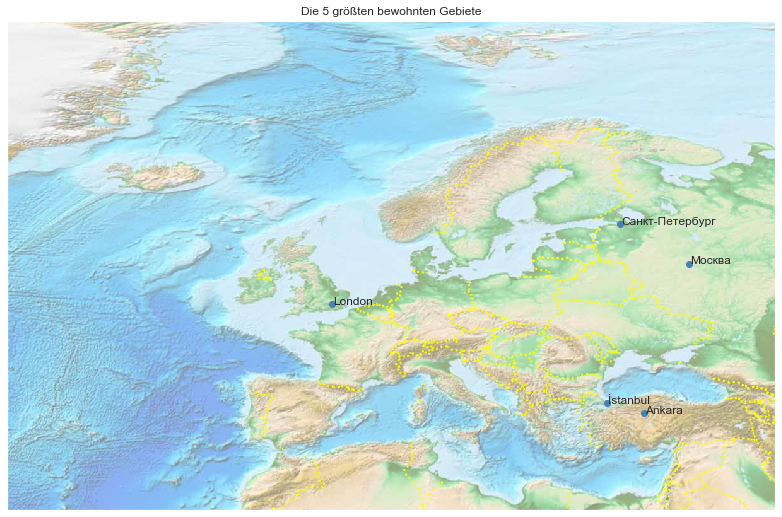

|Name|Lat|Lon|Type|Population|
|----|--:|--:|:--:|---------:|
|İstanbul|41.0096334|28.9651646|City|14804116|
|Москва|55.7504461|37.6174943|City|12380664|
|London|51.5073219|-0.1276474|City|8416535|
|Санкт-Петербург|59.938732|30.316229|City|5225690|
|Ankara|39.9207774|32.854067|City|4338620|

---

## North America [&#10159;](north-america.sqlite)

### Allgemeine Informationen

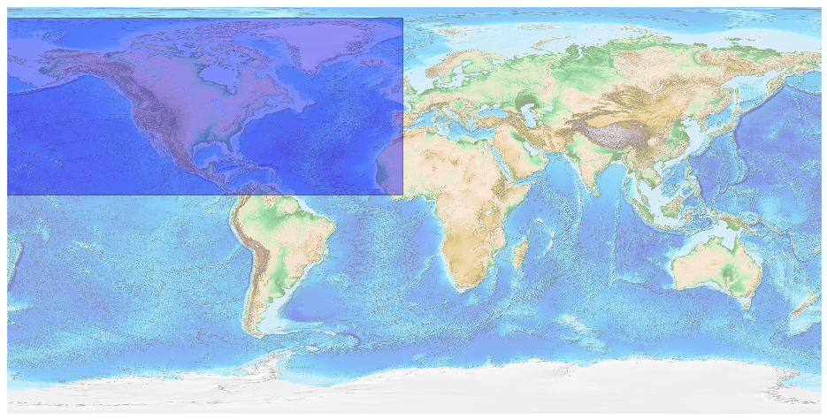

|Eigenschaft|Wert|
|-|-:|
Dateiname|[north-america.sqlite](north-america.sqlite)|
Zeitstempel|05.09.2019 17:04|
Dateigr&ouml;&szlig;e|257.57 Mb|
|||
Gesamtanzahl Nodes|5581459|
|MinLat|6.88283|
|MaxLat|85.04177|
|MinLon|-179.9999|
|MaxLon|-5.198412|

### Top 5 Tags

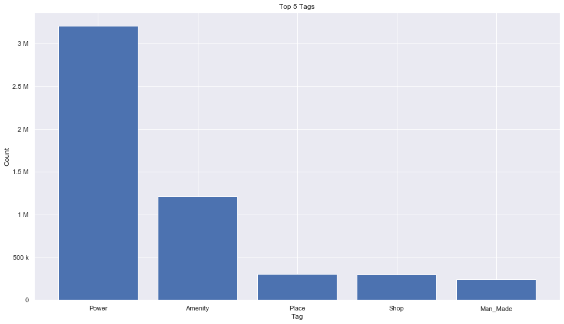

|Tag|Count|
|-|-:|
|Power|3205583|
|Amenity|1211400|
|Place|304231|
|Shop|295204|
|Man_Made|241465|

### &Uuml;bersicht Ortsangaben

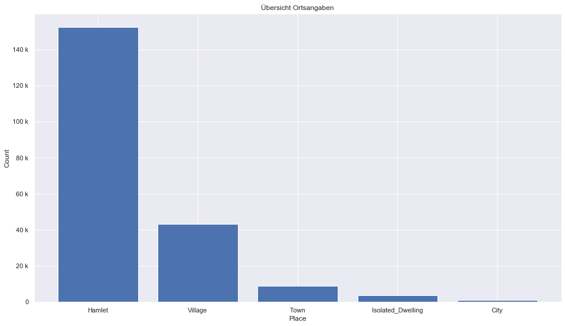

|Place|Count|
|-|-:|
|Hamlet|152283|
|Village|43216|
|Town|8875|
|Isolated_Dwelling|3651|
|City|981|

### Die 5 gr&ouml;&szlig;ten bewohnte Gebiete

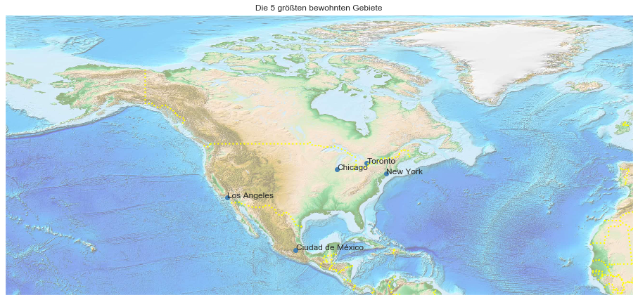

|Name|Lat|Lon|Type|Population|
|----|--:|--:|:--:|---------:|
|Ciudad de México|19.4326009|-99.1333416|City|8555500|
|New York|40.7127281|-74.0060152|City|8550405|
|Los Angeles|34.0536909|-118.2427666|City|3792621|
|Chicago|41.8755616|-87.6244212|City|2695598|
|Toronto|43.653963|-79.387207|City|2651717|

---

## South America [&#10159;](south-america.sqlite)

### Allgemeine Informationen

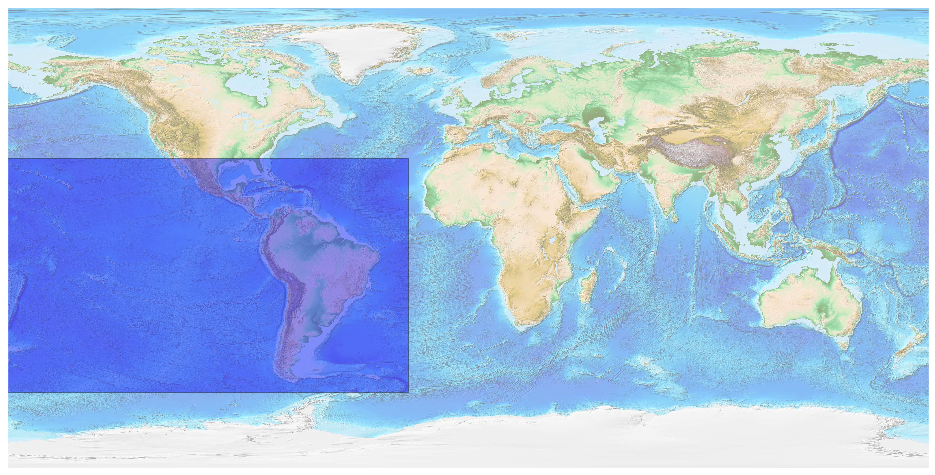

|Eigenschaft|Wert|
|-|-:|
Dateiname|[south-america.sqlite](south-america.sqlite)|
Zeitstempel|05.09.2019 17:56|
Dateigr&ouml;&szlig;e|107.26 Mb|
|||
Gesamtanzahl Nodes|2313756|
|MinLat|-60.34703|
|MaxLat|30.98005|
|MinLon|-179.9999|
|MaxLon|-23.24401|

### Top 5 Tags

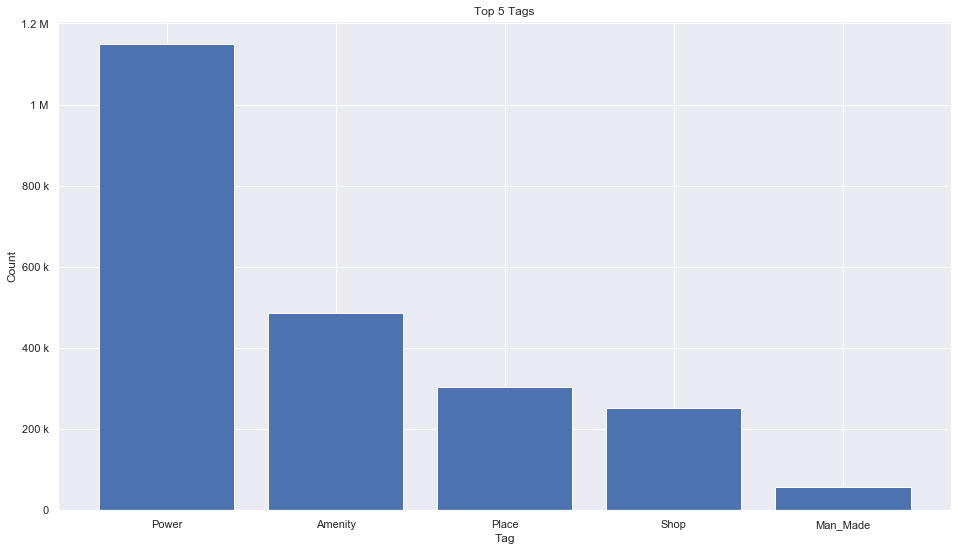

|Tag|Count|
|-|-:|
|Power|1148643|
|Amenity|486667|
|Place|304484|
|Shop|250915|
|Man_Made|57075|

### &Uuml;bersicht Ortsangaben

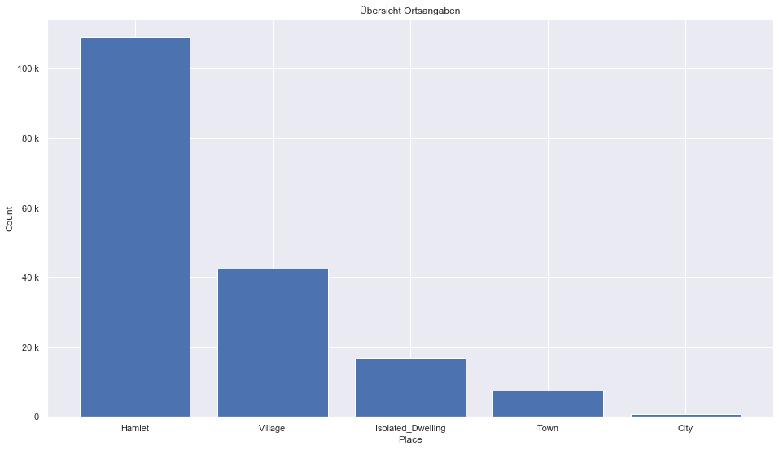

|Place|Count|
|-|-:|
|Hamlet|108854|
|Village|42688|
|Isolated_Dwelling|16918|
|Town|7599|
|City|834|

### Die 5 gr&ouml;&szlig;ten bewohnte Gebiete

|Name|Lat|Lon|Type|Population|
|----|--:|--:|:--:|---------:|
|São Paulo|-23.5506507|-46.6333824|City|12106920|
|Lima|-12.0621065|-77.0365256|City|9989369|
|Bogotá|4.59808|-74.0760439|City|8181047|
|Rio de Janeiro|-22.9110137|-43.2093727|City|6429923|
|Santiago|-33.4377968|-70.6504451|City|6306944|

---

**Some Useful Links:**

- [OpenStreetMap Data Extracts](http://download.geofabrik.de)
- [OpenStreetMap Map Features](https://wiki.openstreetmap.org/wiki/DE:Map_Features)
