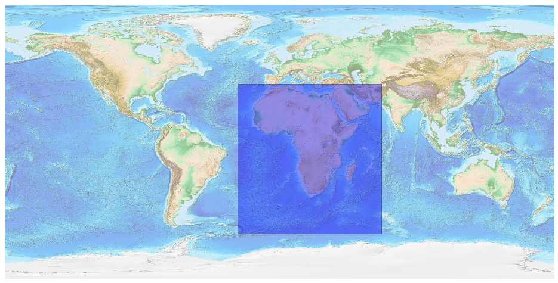
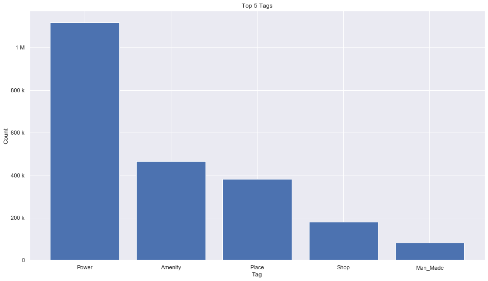

## Africa [&#10159;](africa.sqlite)

### Allgemeine Informationen

|Eigenschaft|Wert|
|-|-:|
Dateiname|[africa.sqlite](africa.sqlite)|
Zeitstempel|05.09.2019 10:58|
Dateigr&ouml;&szlig;e|103.84 Mb|
|||
Gesamtanzahl Nodes|2286129|
|MinLat|-60.3167|
|MaxLat|37.77817|
|MinLon|-27.262032|
|MaxLon|66.7227659|

### Top 5 Tags

|Tag|Count|
|-|-:|
|Power|1117187|
|Amenity|466480|
|Place|381775|
|Shop|180800|
|Man_Made|82470|

### &Uuml;bersicht Ortsangaben

|Place|Count|
|-|-:|
|Village|199563|
|Hamlet|112762|
|Isolated_Dwelling|12259|
|Town|8734|
|City|953|

### Die 5 gr&ouml;&szlig;ten bewohnte Gebiete

|Name|Lat|Lon|Type|Population|
|----|--:|--:|:--:|---------:|
|Lagos|6.4550575|3.3941795|City|10404112|
|القاهرة|30.048819|31.243666|City|9120350|
|Kinshasa|-4.3217055|15.3125974|City|9046000|
|Abidjan|5.320357|-4.016107|City|7567409|
|Luanda|-8.8272699|13.2439512|City|5172900|
