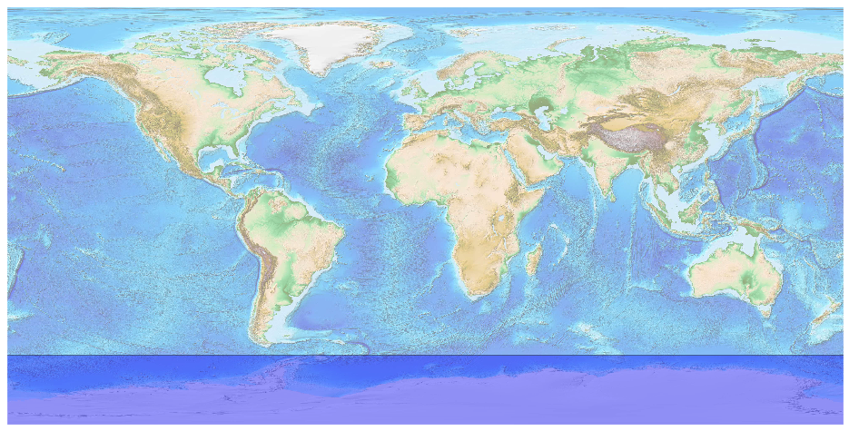
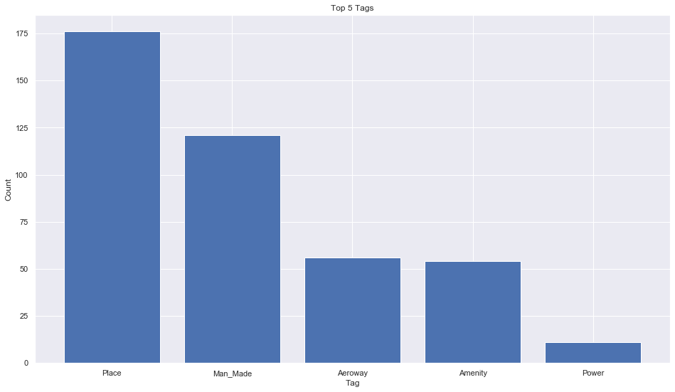
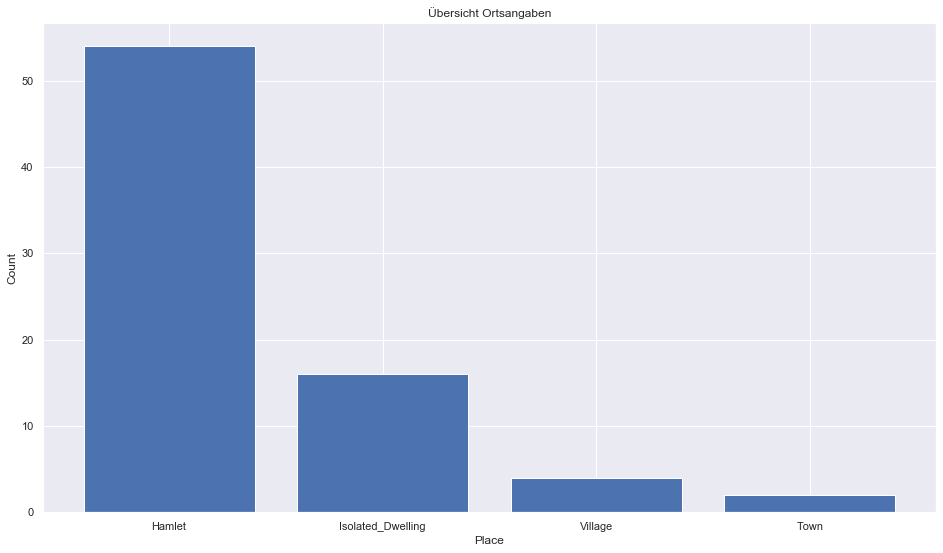
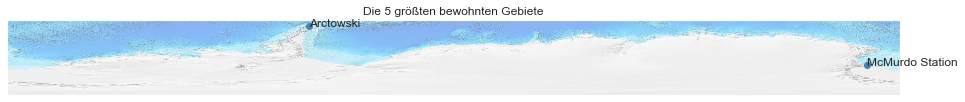

## Antarctica [&#10159;](antarctica.sqlite)

### Allgemeine Informationen

|Eigenschaft|Wert|
|-|-:|
Dateiname|[antarctica.sqlite](antarctica.sqlite)|
Zeitstempel|04.09.2019 20:52|
Dateigr&ouml;&szlig;e|36.00 Kb|
|||
Gesamtanzahl Nodes|426|
|MinLat|-90.0|
|MaxLat|-60.0|
|MinLon|-180.0|
|MaxLon|180.0|

### Top 5 Tags

|Tag|Count|
|-|-:|
|Place|176|
|Man_Made|121|
|Aeroway|56|
|Amenity|54|
|Power|11|

### &Uuml;bersicht Ortsangaben

|Place|Count|
|-|-:|
|Hamlet|54|
|Isolated_Dwelling|16|
|Village|4|
|Town|2|

### Die 5 gr&ouml;&szlig;ten bewohnte Gebiete

|Name|Lat|Lon|Type|Population|
|----|--:|--:|:--:|---------:|
|McMurdo Station|-77.8444733|166.6696371|Town|1300|
|Arctowski|-62.1590141|-58.4719356|Hamlet|40|
