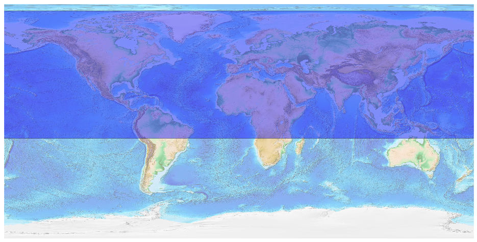
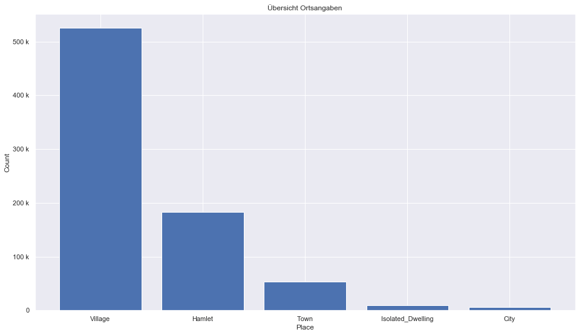

## Asia [&#10159;](asia.sqlite)

### Allgemeine Informationen

|Eigenschaft|Wert|
|-|-:|
Dateiname|[asia.sqlite](asia.sqlite)|
Zeitstempel|05.09.2019 13:21|
Dateigr&ouml;&szlig;e|413.61 Mb|
|||
Gesamtanzahl Nodes|9041041|
|MinLat|-13.01165|
|MaxLat|84.52666|
|MinLon|-180.0|
|MaxLon|180.0|

### Top 5 Tags

|Tag|Count|
|-|-:|
|Power|5403592|
|Amenity|1582211|
|Place|939887|
|Shop|689607|
|Man_Made|189791|

### &Uuml;bersicht Ortsangaben

|Place|Count|
|-|-:|
|Village|525171|
|Hamlet|183159|
|Town|53276|
|Isolated_Dwelling|8918|
|City|5598|

### Die 5 gr&ouml;&szlig;ten bewohnte Gebiete

|Name|Lat|Lon|Type|Population|
|----|--:|--:|:--:|---------:|
|上海市|31.2252985|121.4890497|City|23019196|
|重庆市|29.5585712|106.5492822|City|18400000|
|成都市|30.6624205|104.0633219|City|17700000|
|Delhi|28.6517178|77.2219388|City|16787941|
|天津市|39.1235635|117.1980785|City|15500000|
