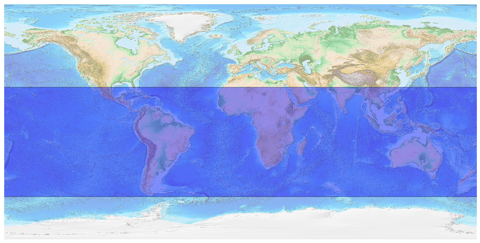
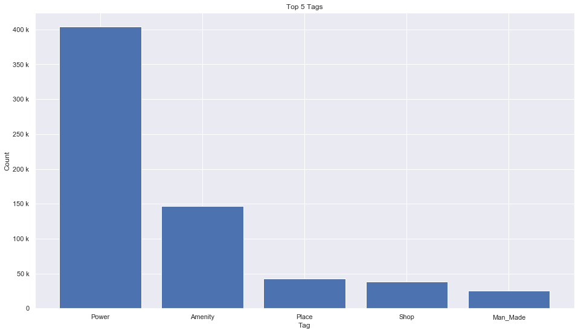
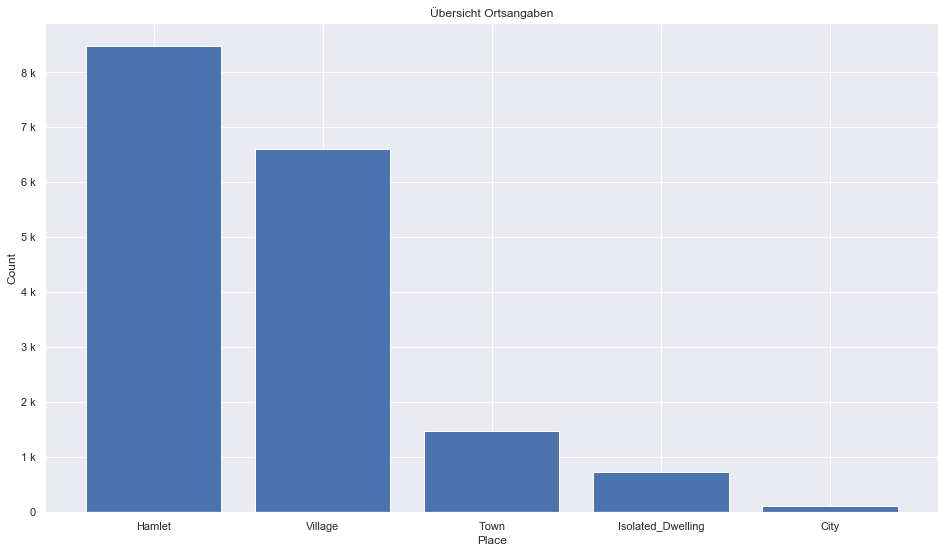
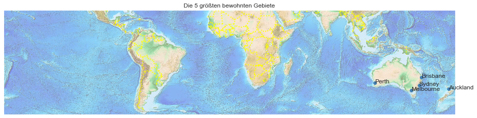

## Australia Oceania [&#10159;](australia-oceania.sqlite)

### Allgemeine Informationen

|Eigenschaft|Wert|
|-|-:|
Dateiname|[australia-oceania.sqlite](australia-oceania.sqlite)|
Zeitstempel|05.09.2019 11:13|
Dateigr&ouml;&szlig;e|30.37 Mb|
|||
Gesamtanzahl Nodes|685378|
|MinLat|-57.16482|
|MaxLat|26.46478|
|MinLon|-180.0|
|MaxLon|180.0|

### Top 5 Tags

|Tag|Count|
|-|-:|
|Power|403859|
|Amenity|146361|
|Place|42932|
|Shop|38261|
|Man_Made|25788|

### &Uuml;bersicht Ortsangaben

|Place|Count|
|-|-:|
|Hamlet|8475|
|Village|6616|
|Town|1472|
|Isolated_Dwelling|724|
|City|117|

### Die 5 gr&ouml;&szlig;ten bewohnte Gebiete

|Name|Lat|Lon|Type|Population|
|----|--:|--:|:--:|---------:|
|Sydney|-33.8548157|151.2164539|City|4627345|
|Melbourne|-37.8142176|144.9631608|City|4440300|
|Brisbane|-27.4689682|153.0234991|City|2190000|
|Perth|-31.9527121|115.8604796|City|1907833|
|Auckland|-36.852095|174.7631803|City|1413700|
