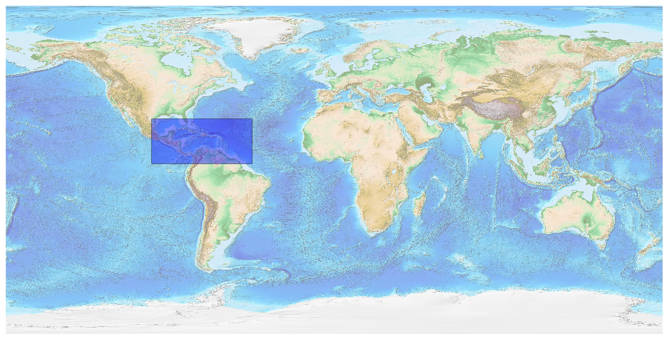

## Central America [&#10159;](central-america.sqlite)

### Allgemeine Informationen

|Eigenschaft|Wert|
|-|-:|
Dateiname|[central-america.sqlite](central-america.sqlite)|
Zeitstempel|04.09.2019 20:59|
Dateigr&ouml;&szlig;e|13.73 Mb|
|||
Gesamtanzahl Nodes|267830|
|MinLat|3.283755|
|MaxLat|28.05483|
|MinLon|-99.82733|
|MaxLon|-44.93667|

### Top 5 Tags

|Tag|Count|
|-|-:|
|Amenity|91886|
|Power|60864|
|Shop|53387|
|Place|44042|
|Man_Made|9138|

### &Uuml;bersicht Ortsangaben

|Place|Count|
|-|-:|
|Hamlet|14479|
|Village|7217|
|Town|1755|
|Isolated_Dwelling|1018|
|City|235|

### Die 5 gr&ouml;&szlig;ten bewohnte Gebiete

|Name|Lat|Lon|Type|Population|
|----|--:|--:|:--:|---------:|
|Ciudad de Guatemala|14.6222328|-90.5185188|City|2450212|
|La Habana|23.135305|-82.3589631|City|2141993|
|Villa Nueva|14.5252531|-90.5882601|City|1500000|
|Port-au-Prince|18.547327|-72.3395928|City|1275000|
|Tegucigalpa|14.0931919|-87.2012631|City|1120000|
