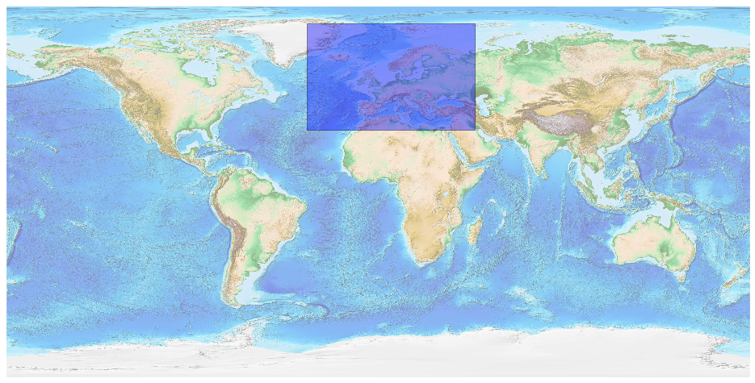

## Europe [&#10159;](europe.sqlite)

### Allgemeine Informationen

|Eigenschaft|Wert|
|-|-:|
Dateiname|[europe.sqlite](europe.sqlite)|
Zeitstempel|05.09.2019 18:59|
Dateigr&ouml;&szlig;e|875.00 Mb|
|||
Gesamtanzahl Nodes|18641815|
|MinLat|29.735139|
|MaxLat|81.47299|
|MinLon|-34.49296|
|MaxLon|46.75348|

### Top 5 Tags

|Tag|Count|
|-|-:|
|Power|7204493|
|Amenity|5024277|
|Place|2606209|
|Shop|1579846|
|Emergency|975788|

### &Uuml;bersicht Ortsangaben

|Place|Count|
|-|-:|
|Hamlet|592888|
|Village|368525|
|Isolated_Dwelling|292280|
|Town|16865|
|City|1110|

### Die 5 gr&ouml;&szlig;ten bewohnte Gebiete

|Name|Lat|Lon|Type|Population|
|----|--:|--:|:--:|---------:|
|İstanbul|41.0096334|28.9651646|City|14804116|
|Москва|55.7504461|37.6174943|City|12380664|
|London|51.5073219|-0.1276474|City|8416535|
|Санкт-Петербург|59.938732|30.316229|City|5225690|
|Ankara|39.9207774|32.854067|City|4338620|
