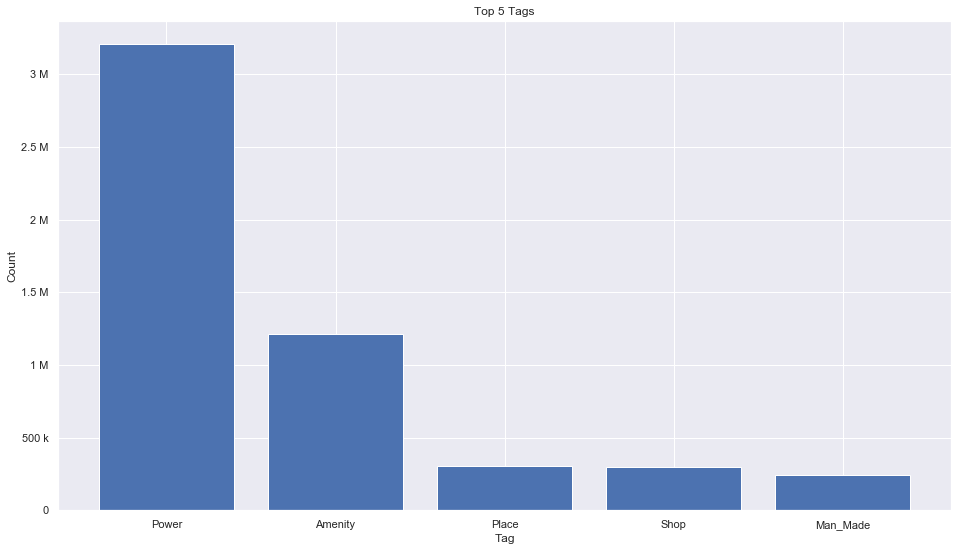
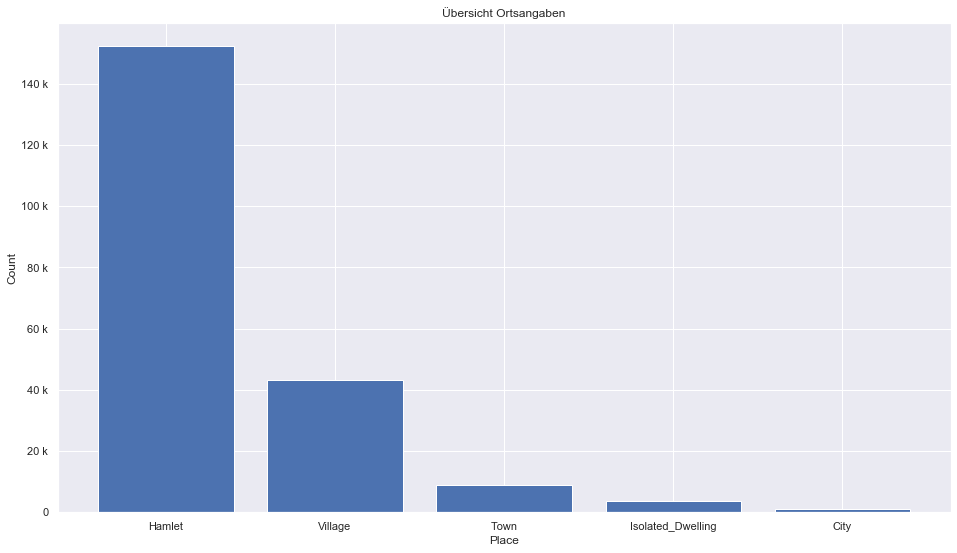

## North America [➯](north-america.sqlite)

### Allgemeine Informationen

|Eigenschaft|Wert|
|-|-:|
Dateiname|[north-america.sqlite](north-america.sqlite)|
Zeitstempel|05.09.2019 17:04|
Dateigröße|257.57 Mb|
|||
Gesamtanzahl Nodes|5581459|
|MinLat|6.88283|
|MaxLat|85.04177|
|MinLon|-179.9999|
|MaxLon|-5.198412|

### Top 5 Tags

|Tag|Count|
|-|-:|
|Power|3205583|
|Amenity|1211400|
|Place|304231|
|Shop|295204|
|Man_Made|241465|

### Übersicht Ortsangaben

|Place|Count|
|-|-:|
|Hamlet|152283|
|Village|43216|
|Town|8875|
|Isolated_Dwelling|3651|
|City|981|

### Die 5 größten bewohnte Gebiete

|Name|Lat|Lon|Type|Population|
|----|--:|--:|:--:|---------:|
|Ciudad de México|19.4326009|-99.1333416|City|8555500|
|New York|40.7127281|-74.0060152|City|8550405|
|Los Angeles|34.0536909|-118.2427666|City|3792621|
|Chicago|41.8755616|-87.6244212|City|2695598|
|Toronto|43.653963|-79.387207|City|2651717|
