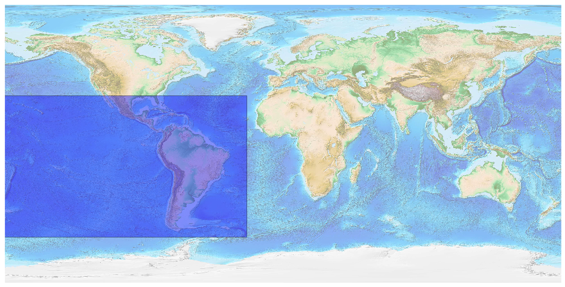
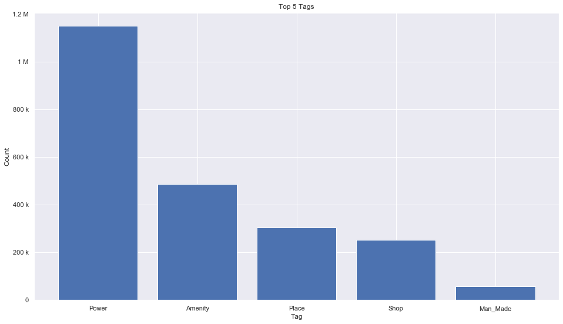
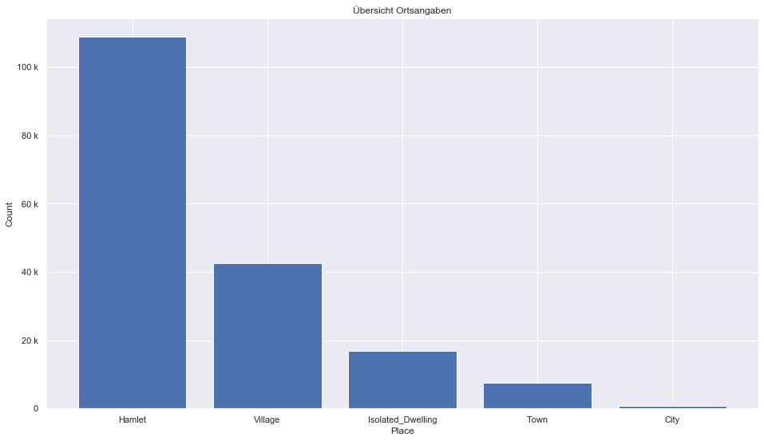
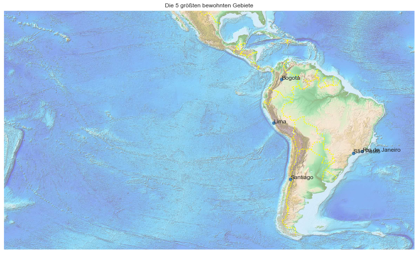

## South America [&#10159;](south-america.sqlite)

### Allgemeine Informationen

|Eigenschaft|Wert|
|-|-:|
Dateiname|[south-america.sqlite](south-america.sqlite)|
Zeitstempel|05.09.2019 17:56|
Dateigr&ouml;&szlig;e|107.26 Mb|
|||
Gesamtanzahl Nodes|2313756|
|MinLat|-60.34703|
|MaxLat|30.98005|
|MinLon|-179.9999|
|MaxLon|-23.24401|

### Top 5 Tags

|Tag|Count|
|-|-:|
|Power|1148643|
|Amenity|486667|
|Place|304484|
|Shop|250915|
|Man_Made|57075|

### &Uuml;bersicht Ortsangaben

|Place|Count|
|-|-:|
|Hamlet|108854|
|Village|42688|
|Isolated_Dwelling|16918|
|Town|7599|
|City|834|

### Die 5 gr&ouml;&szlig;ten bewohnte Gebiete

|Name|Lat|Lon|Type|Population|
|----|--:|--:|:--:|---------:|
|São Paulo|-23.5506507|-46.6333824|City|12106920|
|Lima|-12.0621065|-77.0365256|City|9989369|
|Bogotá|4.59808|-74.0760439|City|8181047|
|Rio de Janeiro|-22.9110137|-43.2093727|City|6429923|
|Santiago|-33.4377968|-70.6504451|City|6306944|
